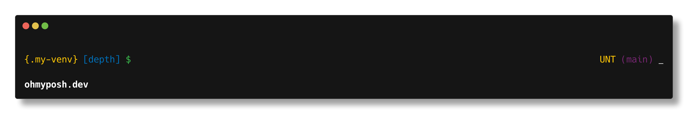
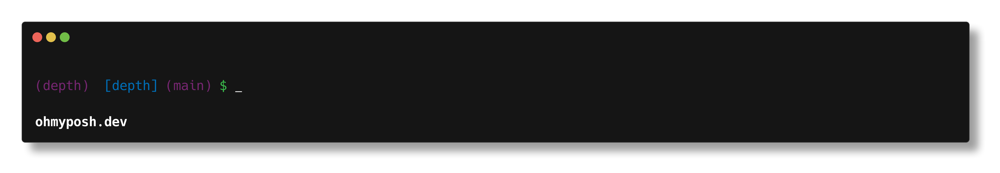
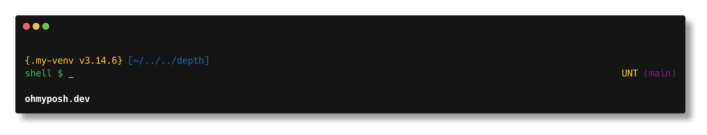

# depth

A minimalist ohmyposh theme with git support. It displays pwd, status code and git status &amp; branch.

## Install

1. [oh-my-posh](https://ohmyposh.dev/docs/installation/linux) is required.
2. Use one of these theme URLs from this repository:

- `https://raw.githubusercontent.com/Robert-96/depth/main/depth.omp.json`
- `https://raw.githubusercontent.com/Robert-96/depth/main/depth.minimal.omp.json`
- `https://raw.githubusercontent.com/Robert-96/depth/main/depth.maximal.omp.json`

3. Initialize oh-my-posh in your shell config using the URL you want:

For zsh (`~/.zshrc`):

```sh
eval "$(oh-my-posh init zsh --config 'https://raw.githubusercontent.com/Robert-96/depth/main/depth.omp.json')"
```

For bash (`~/.bashrc`):

```sh
eval "$(oh-my-posh init bash --config 'https://raw.githubusercontent.com/Robert-96/depth/main/depth.omp.json')"
```

For PowerShell (`$PROFILE`):

```powershell
oh-my-posh init pwsh --config 'https://raw.githubusercontent.com/Robert-96/depth/main/depth.omp.json' | Invoke-Expression
```

## Screenshots

### depth



### depth.minimal



### depth.maximal


